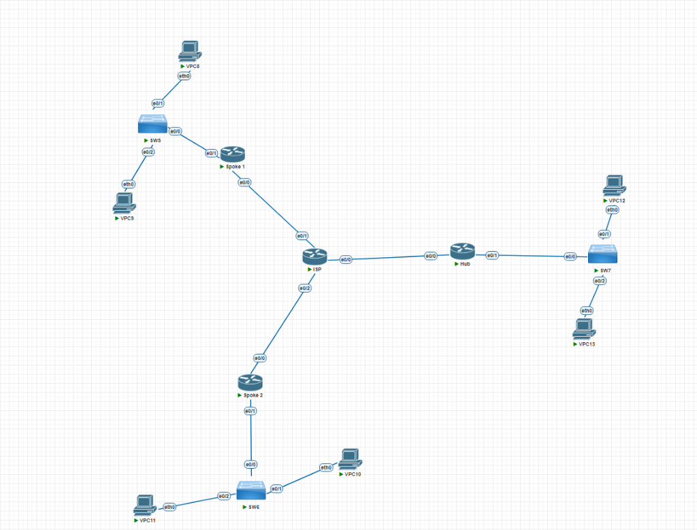
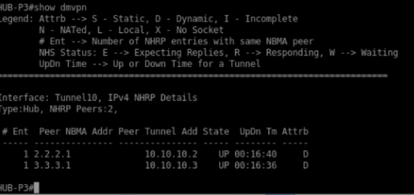
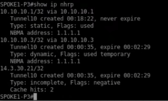
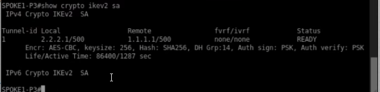
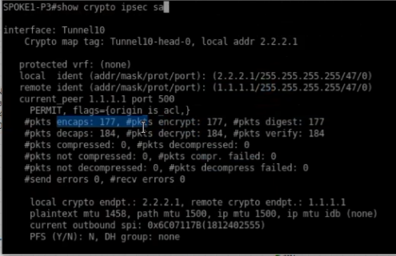
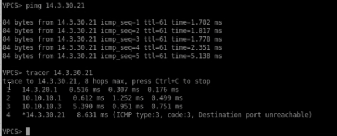

<h1>Instituto Tecnológico de Las Américas (ITLA)</h1>
  
<h2>Configuración y Verificación de DMVPN Fase 3 con IKEv2 y Enrutamiento Dinámico (OSPF)</h2>

Documentación Técnica Profesional — Práctica 5 (Semana 6)

   

<strong>Estudiante:</strong> Alan Daniel Garcia Mendez 
<strong>Matrícula:</strong> 2025-1403 
<strong>Carrera:</strong> Seguridad Informática 
<strong>Asignatura:</strong> Seguridad de Redes 
<strong>Docente:</strong> Jonathan Esteban Rondon Corniel 
<strong>Fecha de Entrega:</strong> 2 de julio de 2026 
<strong>Video de Exposición:</strong> <a href="https://youtu.be/hoGJjk126xM">https://youtu.be/hoGJjk126xM</a>

## Objetivo de la VPN
Implementar una red DMVPN (Dynamic Multipoint VPN) de Fase 3, utilizando el protocolo moderno de negociación IKEv2 para asegurar los túneles e incorporando el protocolo OSPF como mecanismo de enrutamiento dinámico corporativo. El objetivo primordial de la Fase 3 es superar las limitaciones de direccionamiento de la Fase 2 mediante la introducción de la optimización del enrutamiento lógicos a nivel de NHRP. Esto se logra permitiendo la sumarización de rutas en el Hub y reescribiendo la tabla de rutas en caliente mediante redirecciones y atajos dinámicos de atajo (`shortcut`), lo cual permite la comunicación Spoke-to-Spoke en un solo salto sin requerir complejas configuraciones de preservación de Next Hop en OSPF.

## Topología de Red y Direccionamiento
La topología lógica conecta de forma multipunto los dispositivos sucursales mediante direccionamiento de túnel mGRE en el rango lógico `10.10.10.0/24` (bajo el ID de red 200).

  
  
Topología física del laboratorio DMVPN en GNS3

El direccionamiento configurado para las interfaces físicas y lógicas del escenario es:

| Dispositivo / Rol | Interfaz WAN (IP/GW) | Interfaz LAN IP | Túnel mGRE (IP/DR) |
| :--- | :--- | :--- | :--- |
| **Router HUB-P3** | `1.1.1.1/24` (GW: `.254`) | `14.3.10.1/24` | `10.10.10.1/24` (Prioridad DR: 255) |
| **Router SPOKE1-P3** | `2.2.2.1/24` (GW: `.254`) | `14.3.20.1/24` | `10.10.10.2/24` (Prioridad DR: 0) |
| **Router SPOKE2-P3** | `3.3.3.1/24` (GW: `.254`) | `14.3.30.1/24` | `10.10.10.3/24` (Prioridad DR: 0) |

## Parámetros Criptográficos y de Red
Los parámetros configurados para la seguridad IPSec IKEv2 y el enrutamiento dinámico en Fase 3 son:

| Tecnología | Parámetro | Valor Configurado | Descripción |
| :--- | :--- | :--- | :--- |
| **IKEv2** | Configuración | Proposal (`IKEV2-PROP`) / Policy | Criptografía aes-cbc-256 e integridad sha256. |
| **IKEv2** | Autenticación | Pre-share (Clave: `DMVPN456`) | Llavero de autenticación dinámica global. |
| **IPSec** | Transform-Set | `TS-DMVPN-IKEV2` | Cifrado `esp-aes 256 esp-sha256-hmac` en transporte. |
| **NHRP** | ID / Auth | `200` / `DMVPNKEY` | Red de resolución NHRP y clave de autenticación. |
| **Enrutamiento** | Protocolo Dinámico | OSPF Área 0 (Proceso 20) | Anuncia las subredes LAN y la red de túnel. |
| **Fase 3 NHRP** | Control de Tránsito | `ip nhrp redirect` en el HUB | Permite al HUB redirigir las peticiones Spoke-to-Spoke. |
| **Fase 3 NHRP** | Control de Cliente | `ip nhrp shortcut` en Spokes | Permite a Spokes reescribir atajos en la tabla de rutas. |

## Explicación de la Configuración de Fase 3
A diferencia de la Fase 2, en la Fase 3 de DMVPN se resuelven las limitaciones de la tabla de enrutamiento al introducir dos comandos claves a nivel de NHRP:
1. **`ip nhrp redirect` (en el Hub):** Cuando el Hub detecta que un paquete entra por la interfaz `Tunnel10` y se vuelve a redirigir por la misma interfaz (lo que ocurre cuando el Spoke 1 le envía datos al Spoke 2 a través de él), el Hub envía un mensaje de redireccionamiento NHRP al Spoke origen indicando que existe una ruta más directa.
2. **`ip nhrp shortcut` (en los Spokes):** Habilita al Spoke a procesar las redirecciones del Hub e instalar dinámicamente atajos lógicos en su tabla de enrutamiento (marcadas como rutas NHRP). Esto sobrescribe el siguiente salto del OSPF original y permite al Spoke enviar tráfico directo al otro Spoke de forma transparente.

La seguridad en Fase 3 se refuerza con la integración de IKEv2, la cual utiliza propuestas y políticas más eficientes que disminuyen el consumo de CPU durante la renegociación del canal cifrado del túnel multipunto.

Los scripts detallados aplicados se encuentran en: [script_configuracion.txt](resources/script_configuracion.txt).

## Verificación de Funcionamiento

### 1. Registro de Clientes NHRP en el Next Hop Server (HUB)
Para comprobar que los enrutadores sucursales (Spokes) se encuentran registrados dinámicamente en el concentrador corporativo, se ejecuta el comando `show dmvpn` en el router `HUB-P3`. La salida confirma el registro exitoso de los **2 peers remotos** (`NHRP Peers: 2`).

El Hub documenta que ambos extremos del túnel mGRE de la Fase 3 se encuentran en estado **`UP`** con atributo dinámico **`D`**:
* Peer `2.2.2.1` ➔ IP de Túnel `10.10.10.2` (SPOKE1)
* Peer `3.3.3.1` ➔ IP de Túnel `10.10.10.3` (SPOKE2)

  
  
Salida de show dmvpn en el HUB-P3 demostrando a ambos clientes multiplexados activos

### 2. Tabla NHRP en Spokes con Atajos y Redireccionamiento Dinámico (Fase 3)
La base de datos NHRP se verifica con el comando `show ip nhrp` en `SPOKE1-P3` después de iniciar la transmisión de datos hacia Spoke 2. La salida revela el mecanismo nativo de la Fase 3:
1. Una entrada estática hacia el Hub `10.10.10.1` en la IP WAN `1.1.1.1`.
2. Una entrada de resolución dinámica temporal establecida para la IP del túnel del Spoke 2: **`10.10.10.3/32 via 10.10.10.3`** bajo la IP WAN `1.1.1.1` (temporal).
3. La instalación del atajo para el host remoto de la LAN de Spoke 2: **`14.3.30.21/32 via 10.10.10.3`** en estado **`incomplete`** (representado con la letra **`H`**). Esto demuestra que Spoke 1 ha reescrito de forma dinámica su tabla de adyacencias NHRP para redirigir el tráfico hacia Spoke 2 directamente.

  
  
Detalles de show ip nhrp en SPOKE1-P3 documentando la resolución de atajo H para la subred remota

### 3. Estado de la Sesión IKEv2 SA (Fase 1)
La comprobación de la Fase 1 bajo IKEv2 se ejecuta con el comando `show crypto ikev2 sa` en `SPOKE1-P3`. La salida de consola ratifica que se ha negociado exitosamente una sesión criptográfica robusta hacia el peer remoto del Hub `1.1.1.1` desde la dirección local `2.2.2.1`. 

La SA está en el estado estable **`READY`**, y reporta los algoritmos configurados: **`Encr: AES-CBC, keysize: 256, Hash: SHA256, DH Grp:14, Auth sign/verify: PSK`**.

  
  
Estado IKEv2 SA en SPOKE1-P3 confirmando la sesión de control activa hacia el HUB

### 4. Asociación de Seguridad IPSec en el Túnel Multipunto (Fase 2)
Al ejecutar el comando `show crypto ipsec sa` en `SPOKE1-P3`, se verifica el cifrado de datos de la interfaz Tunnel10 protegida por el perfil multipunto. La SA de datos se asocia hacia el peer público del Hub `1.1.1.1`:
* `local ident: (2.2.2.1/255.255.255.255/47/0)` (GRE en Spoke 1)
* `remote ident: (1.1.1.1/255.255.255.255/47/0)` (GRE en Hub)

Los contadores confirman un tránsito masivo de paquetes cifrados sin pérdidas:
* **`#pkts encaps: 177`** y **`#pkts encrypt: 177`**
* **`#pkts decaps: 184`** y **`#pkts decrypt: 184`**

  
  
Estadísticas de la SA IPSec de Tunnel10 en SPOKE1-P3 procesando paquetes cifrados

### 5. Prueba de Conectividad y Trazado de Ruta Directo (NHRP Redirect en Fase 3)
La validación definitiva se realiza en la terminal del host VPCS corporativo detrás de Spoke 1 (LAN `14.3.20.0/24`). Al ejecutar `ping 14.3.30.21` hacia la IP del host en la LAN de Spoke 2, se obtiene respuesta inmediata con **0% de pérdida**.

Posteriormente, al ejecutar `tracer 14.3.30.21`, se comprueba experimentalmente la resolución de atajo característica de la Fase 3:
1. El primer salto se dirige al gateway local `14.3.20.1` (interfaz del router Spoke 1).
2. El segundo salto pasa por la IP del túnel del Hub **`10.10.10.1`** (donde el Hub recibe el paquete inicial, detecta la salida por la misma interfaz tunnel y envía el mensaje de redireccionamiento NHRP redirect a Spoke 1).
3. El tercer salto se dirige de manera directa a la IP del túnel del Spoke 2 **`10.10.10.3`** una vez que el Spoke 1 procesa el redireccionamiento, realiza la consulta e instala el atajo NHRP en su caché, puenteando de ahí en adelante la necesidad de pasar por el Hub.
4. El cuarto salto alcanza con éxito al host final `14.3.30.21`.

  
  
Prueba de conectividad en VPCS confirmando la resolución y el salto dinámico a través de 10.10.10.3

